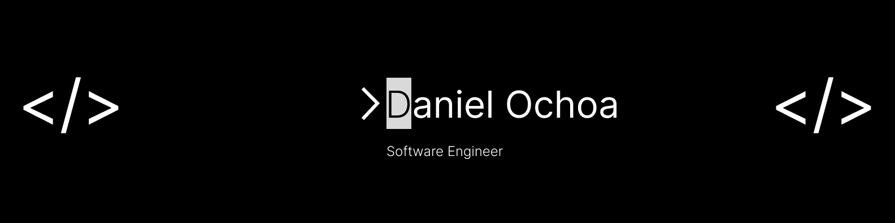

# Hi! I'm Daniel Ochoa

## 💫 About Me:
I'm a passionate and driven systems engineering student at Escuela Colombiana de Ingenieria Julio Garavito with a strong interest in software engineering and web development. with a strong basis in algorithms, Scrum work techniques, and object-oriented programming.

My skills span across various technologies, including Java Spring Boot and Python for backend development. I also have experience with Angular, CSS, HTML, Vanilla JavaScript, and Java Spring for creating engaging user interfaces. Throughout my academic journey, I've been honing my skills in problem-solving and algorithm design to create efficient and scalable solutions.

Visit my repositories listed below to browse a variety of personal projects and class assignments. You can contact me at danochoa1412@gmail.com if you're interested in interacting or working together. 

## Cool projects I've made
*******

# 💻 Tech Stack:
                  	  

## 🌐 Connect with me :
 

# 📊 GitHub Stats:
 
 

## 🏆 GitHub Trophies

### ✍️ Random Dev Quote

---

<!-- Proudly created with GPRM ( https://gprm.itsvg.in ) -->
